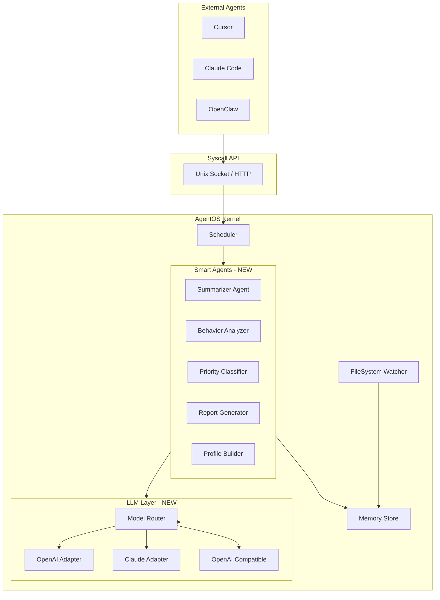

# AgentOS v0.2 — 从索引到理解

## 现状

当前 v0.1 的 6 个内置 Agent 全是规则驱动（SQLite 查询 + 字符串匹配），没有任何 LLM 能力。文件被索引了，但没有被"理解"。

## 架构演进




## 一、LLM 统一抽象层

新建 [src/llm/](src/llm/) 目录，统一封装所有模型调用。

### 核心设计

- **ModelRouter** — 根据任务类型自动选模型（摘要用便宜快速的，深度分析用强模型）
- **OpenAI Adapter** — 支持 GPT-4o / GPT-4.1 / o3-mini
- **Claude Adapter** — 支持 Sonnet / Opus
- **OpenAI Compatible Adapter** — 支持 DeepSeek、Groq、Together、本地 Ollama 等任何 OpenAI 兼容 API

配置方式（在 `config/default.yaml` 中新增）:

```yaml
llm:
  default_provider: "openai"
  providers:
    openai:
      api_key_env: "OPENAI_API_KEY"
      models:
        fast: "gpt-4o-mini"
        strong: "gpt-4o"
    claude:
      api_key_env: "ANTHROPIC_API_KEY"
      models:
        fast: "claude-sonnet-4-20250514"
        strong: "claude-opus-4-20250514"
    compatible:
      base_url: ""  # e.g. http://localhost:11434/v1
      api_key_env: "COMPATIBLE_API_KEY"
      models:
        fast: "deepseek-chat"
        strong: "deepseek-chat"
  routing:
    summarize: "fast"
    analyze: "strong"
    classify: "fast"
    report: "strong"
```

关键文件:

- `src/llm/__init__.py`
- `src/llm/base.py` — 统一接口 `LLMProvider.complete(messages, model_tier)`
- `src/llm/openai_adapter.py`
- `src/llm/claude_adapter.py`
- `src/llm/compatible_adapter.py`
- `src/llm/router.py` — 按任务类型 + 配置路由到具体 provider

## 二、智能守护 Agent（5 个新 Agent）

全部注册到 Scheduler，部分由 Kernel 定时触发（cron-like），部分响应 syscall。

### 1. SummarizerAgent — 定期文件摘要

- **触发**: 每次全量扫描后 / 文件变更时
- **功能**: 用 LLM 生成每个文件的语义摘要（替换当前的规则提取），存入 `file_index.summary`
- **增量**: 只摘要 hash 变化的文件，batch 处理减少 API 调用
- 新文件: `src/agents/summarizer.py`

### 2. BehaviorAnalyzerAgent — 用户行为分析

- **触发**: 每小时 / 每天
- **功能**: 分析文件访问/修改模式（哪些目录最活跃、什么时间段工作、常编辑什么类型）
- **数据来源**: `file_index` 中的 `modified_at` + `indexed_at` 时序数据
- **输出**: 存入 `knowledge` 表，category = "behavior_insight"
- 新文件: `src/agents/analyzer.py`

### 3. PriorityClassifierAgent — 文件优先级分类

- **触发**: 行为分析后 / 手动
- **功能**: 基于行为分析结果 + 文件内容，将文件分为优先级层:
  - **P0 (Hot)**: 正在活跃编辑的项目文件
  - **P1 (Warm)**: 近期频繁访问的参考文件
  - **P2 (Cold)**: 归档/很少碰的文件
- **效果**: 外部 Agent 查询时优先返回高优先级文件，减少噪声
- **存储**: `file_index` 表新增 `priority` 列
- 新文件: `src/agents/prioritizer.py`

### 4. ReportGeneratorAgent — 定时报告

- **触发**: 每天 / 被外部 Agent 主动请求
- **功能**: 生成结构化报告供外部 Agent 消费:
  - **日报**: 今天改了哪些文件、项目进展、待办推断
  - **项目画像**: 每个项目目录的技术栈、关键文件、依赖关系
  - **上下文简报**: 当外部 Agent 启动新会话时，SysAgent 返回"你需要知道的一切"
- **输出**: 存入 `knowledge` 表，category = "daily_report" / "project_profile" / "context_brief"
- 新 syscall: `report.daily`, `report.project`, `report.brief`
- 新文件: `src/agents/reporter.py`

### 5. ProfileBuilderAgent — 个人画像构建

- **触发**: 首次启动 / 每周更新
- **功能**: 从所有索引数据中推断用户画像:
  - 常用编程语言和框架
  - 项目列表和当前聚焦项目
  - 编码风格偏好（tab/space、命名规范等）
  - 工作时间模式
- **效果**: 外部 Agent 启动时可以一次性获取用户画像，不用反复猜
- 新 syscall: `profile.get`
- 新文件: `src/agents/profile_builder.py`

## 三、Kernel 新增定时调度 (Cron)

在 [src/kernel/daemon.py](src/kernel/daemon.py) 中新增 `CronScheduler`，支持:

```python
cron_jobs:
  - agent: "summarizer"
    trigger: "after_scan"       # 每次文件扫描后
  - agent: "behavior_analyzer"
    trigger: "interval"
    interval_hours: 6
  - agent: "priority_classifier"
    trigger: "after:behavior_analyzer"  # 行为分析完成后
  - agent: "report_generator"
    trigger: "daily"
    time: "09:00"
  - agent: "profile_builder"
    trigger: "weekly"
```

## 四、新增 Syscall 类型

在 [src/syscall/protocol.py](src/syscall/protocol.py) 中新增:

- `report.daily` — 获取今日报告
- `report.project` — 获取项目画像
- `report.brief` — 获取上下文简报（给外部 Agent 用）
- `profile.get` — 获取用户画像
- `file.search_smart` — 语义搜索（LLM 增强）
- `summarize.file` — 主动请求摘要某文件

## 五、数据库 Schema 变更

`file_index` 表新增列:

- `priority` INTEGER DEFAULT 1 (0=hot, 1=warm, 2=cold)
- `semantic_summary` TEXT (LLM 生成的语义摘要)
- `last_accessed_at` REAL

`knowledge` 表新增分类:

- `behavior_insight` — 行为分析结果
- `daily_report` — 日报
- `project_profile` — 项目画像
- `user_profile` — 用户画像
- `context_brief` — 上下文简报

## 六、实现顺序

分 3 个阶段，每个阶段可独立验证:

- **Phase 1**: LLM 抽象层 + SummarizerAgent（让文件摘要真正有用）
- **Phase 2**: BehaviorAnalyzer + PriorityClassifier + Cron 调度（让系统"主动思考"）
- **Phase 3**: ReportGenerator + ProfileBuilder + 新 Syscall（让外部 Agent 真正受益）

## 七、还可以做但先不做的功能（路线图）

- **SemanticSearchAgent**: 向量化索引 + 语义搜索（用 embedding 替代 LIKE）
- **NotificationAgent**: 主动推送（检测到异常文件变更、项目依赖有安全漏洞）
- **ConversationMemoryAgent**: 记住你和每个 Agent 的历史对话摘要
- **AutomationAgent**: 检测重复操作模式，自动生成 shell 脚本/macro
- **MultiUserAgent**: 多用户隔离（团队场景）
- **PluginSystem**: 允许第三方注册自定义 Agent 到 SysAgent

