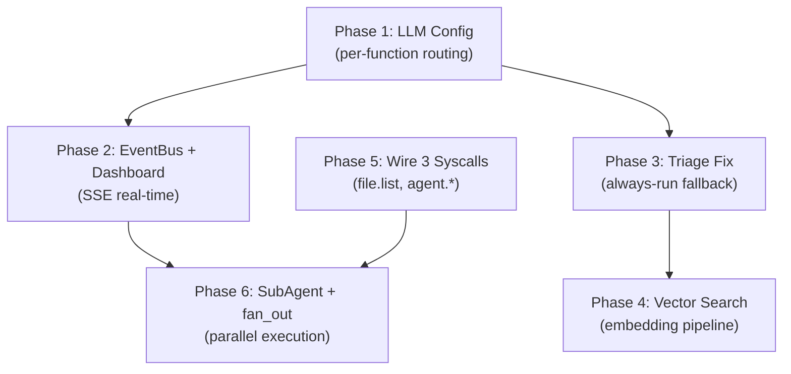

# AgentOS v0.5 -- Per-Function LLM Routing, Live Dashboard, SubAgent Architecture

## My Design Opinions (where I disagree or refine your ideas)

1. **LLM as "Brain", not "CPU"**: The LLM should be the decision-maker (what to run, what priority, what to skip), but the scheduler remains the CPU. Letting the LLM be the actual executor introduces latency, cost, and unpredictability. The pattern should be: LLM plans -> scheduler executes -> agents report back -> LLM adjusts.
2. **SubAgent vs AgentProcess**: Agree that "SubAgent" is cleaner. But I'd frame it differently -- rather than a new class hierarchy, a SubAgent is simply an `AgentTask` with a `parent_task_id`. The scheduler already supports concurrency. What's missing is the *coordination* (fan-out/fan-in) and *communication* (event bus), not the execution model.
3. **Analyze consumes both file_index AND summaries**: Current design is correct -- behavior analysis reads `file_index` stats + `project_summary` knowledge + per-file `semantic_summary`. This is the right layered approach. Making it ONLY summary-dependent would mean no analysis until summarization catches up.
4. **Vector search scope**: With 200K+ files, we should ONLY embed files that have `semantic_summary` (post-triage high/medium). This keeps the vector DB manageable (~10K-30K embeddings vs 200K).

---

## Phase 1: LLM Config Redesign

### Problem

Current routing maps `task_type -> tier -> model` within a **single default provider**. You cannot:

- Use Anthropic for text triage but OpenAI for vision summarization
- Pick a reasoning model for triage/analyze while using a fast model for summarize
- Override provider per function

### New Config Schema (in [config/default.yaml](config/default.yaml))

```yaml
llm:
  providers:
    openai:
      api_key_env: "OPENAI_API_KEY"
      models:
        fast: "gpt-4o-mini"
        strong: "gpt-4o"
        vision: "gpt-4o"          # vision capable
    anthropic:
      api_key_env: "ANTHROPIC_API_KEY"
      models:
        fast: "claude-sonnet-4-20250514"
        strong: "claude-opus-4-20250514"
        reasoning: "claude-opus-4-20250514"  # new tier for thinking tasks
    # ... other providers ...

  defaults:
    text_provider: "anthropic"
    text_tier: "fast"
    vision_provider: "openai"
    vision_tier: "vision"

  functions:
    triage:
      text_provider: "anthropic"
      text_tier: "reasoning"          # user wants reasoning for triage
    summarize:
      # inherits defaults (anthropic fast for text, openai vision for images)
    analyze:
      text_tier: "reasoning"          # user wants reasoning for analyze
    report: {}                        # inherits defaults
    brief: {}                         # inherits defaults
    profile:
      text_tier: "strong"
    search:
      text_tier: "fast"
```

### Router Changes ([src/llm/router.py](src/llm/router.py))

The `ModelRouter.complete()` method gains awareness of per-function config:

```python
async def complete(self, messages, task_type="summarize", is_vision=False, ...):
    func_cfg = self._functions.get(task_type, {})
    if is_vision:
        provider_name = func_cfg.get("vision_provider", self._defaults["vision_provider"])
        tier = func_cfg.get("vision_tier", self._defaults["vision_tier"])
    else:
        provider_name = func_cfg.get("text_provider", self._defaults["text_provider"])
        tier = func_cfg.get("text_tier", self._defaults["text_tier"])
    # resolve provider -> model from tier
```

Key change: callers now pass `is_vision=True` for multimodal requests (currently only `summarizer.py`'s `_summarize_image`), and the router resolves provider+model independently for text vs vision.

### Files to modify

- [src/kernel/config.py](src/kernel/config.py) -- add `defaults` and `functions` to `LLMConfig`
- [src/llm/router.py](src/llm/router.py) -- rework resolution logic
- [config/default.yaml](config/default.yaml) -- new schema
- [src/web/dashboard.py](src/web/dashboard.py) + [dashboard.html](src/web/dashboard.html) -- update LLM Config UI

---

## Phase 2: Dashboard Real-Time Overhaul

### Current Pain Points

1. **No live progress**: Triage/summarize show only aggregate counts via 30s polling
2. **No model output visibility**: Cannot see what the LLM is producing in real-time
3. `**/api/daemon` dead in UI**: Richer kernel status exists but isn't wired
4. **Triage `by_directory` not rendered**
5. **No task queue visibility**: Cannot see what's running/queued

### Solution: SSE EventBus + Live Activity Tab

#### 2a. EventBus ([src/kernel/event_bus.py](src/kernel/event_bus.py) -- new file)

```python
class EventBus:
    """Lightweight pub/sub for agent lifecycle events."""
    
    async def emit(self, event: AgentEvent):
        # broadcast to all SSE subscribers
        # persist to ring buffer (last 500 events) for dashboard reconnect
    
    def subscribe(self) -> asyncio.Queue:
        # return a queue that receives all events
```

Event types:

- `task.started` / `task.completed` / `task.failed`
- `triage.batch_progress` (files classified so far / total untriaged)
- `summarize.file_progress` (file path, summary preview)
- `llm.request` / `llm.response` (model, tokens, latency, truncated I/O)
- `cron.decision` (what the adaptive scheduler decided)

#### 2b. SSE Endpoint in Dashboard

```
GET /api/events  (text/event-stream)
```

Dashboard JS subscribes via `EventSource` and updates a **Live Activity** panel in real-time.

#### 2c. New Dashboard Tabs/Panels

**Live Activity Tab** (new):

- Current running tasks with elapsed time and progress bar
- Task queue depth
- Recent LLM calls: model, task_type, token count, latency, expandable I/O
- Triage progress: real-time "classified X/Y files" with a moving progress bar
- Summarize progress: real-time "summarized X/Y files" with current file name

**Triage Tab** (enhanced):

- Add `by_directory` breakdown (already returned by API, just not rendered)
- Live triage count updating via SSE

**Overview Tab** (enhanced):

- Wire up `/api/daemon` for rich kernel status (uptime, active tasks, queue depth)
- Replace pid-file-based status with live daemon connection check

### Files to modify/create

- `src/kernel/event_bus.py` (new)
- [src/kernel/daemon.py](src/kernel/daemon.py) -- inject EventBus into context
- [src/llm/router.py](src/llm/router.py) -- emit `llm.request`/`llm.response` events
- [src/agents/triage.py](src/agents/triage.py) -- emit progress events
- [src/agents/summarizer.py](src/agents/summarizer.py) -- emit progress events
- [src/scheduler/pool.py](src/scheduler/pool.py) -- emit task lifecycle events
- [src/web/dashboard.py](src/web/dashboard.py) -- add SSE endpoint, inject EventBus
- [src/web/dashboard.html](src/web/dashboard.html) -- Live Activity tab, SSE client

---

## Phase 3: Triage Pipeline Fix

### Issue #8: No-LLM fallback only triages in deep hours

Current behavior in [src/kernel/cron.py](src/kernel/cron.py) `_default_decision`:

- Deep hour (3AM) -> runs full stack including triage
- High activity -> only light summarizer + quick report (no triage)
- Normal -> deep summarizer + behavior (no triage)

**Fix**: Triage should ALWAYS run after scan regardless of LLM availability. The rule-based pass (Phase 1 of triage) is free and marks ~90% of noise as `skip`. Even without LLM, this dramatically helps summarizer prioritize.

Changes to `_default_decision` in [src/kernel/cron.py](src/kernel/cron.py):

- Add `"triage"` to all fallback paths (not just deep hour)
- Ensure `after_scan` trigger fires triage unconditionally

### Confirm Pipeline Order

The pipeline is correct: `after_scan -> triage -> (after:triage) -> summarizer`. This is enforced by YAML triggers and adaptive scheduler prompt.

---

## Phase 4: Vector Semantic Search

### Current State

Config claims embedding support (`all-MiniLM-L6-v2`), but search is SQL `LIKE`.

### Implementation

**DB Migration** (in [src/memory/store.py](src/memory/store.py)):

- Add `embedding BLOB` column to `file_index` (store as numpy bytes)
- Add `embedding_model TEXT` column (track which model generated it)

**Embedding Pipeline**:

- After summarizer writes `semantic_summary`, compute embedding of that summary
- Use `sentence-transformers` with `all-MiniLM-L6-v2` (384 dimensions, ~80MB model)
- Only embed files with `triage_status` in (`high`, `medium`) -- keeps scope to ~10K-30K files

**Search** (in `file.search` agent):

- If query is short/keyword-like: keep SQL LIKE
- If query is natural language: embed query -> cosine similarity against stored embeddings -> rank

**Files to modify**:

- [src/memory/store.py](src/memory/store.py) -- migration, embedding storage, vector search
- [src/agents/summarizer.py](src/agents/summarizer.py) -- trigger embedding after summary
- `src/memory/embeddings.py` (new) -- embedding model wrapper
- Agent for `file.search` in [src/agents/builtin.py](src/agents/builtin.py)

---

## Phase 5: Wire 3 Dangling Syscalls

### `file.list`

Map to a new lightweight agent (or extend `file_search`) that returns `file_index` rows matching a directory/type/triage filter. Unlike `file.search` (which searches content), this is metadata listing.

### `agent.submit`

Wire to `AgentScheduler.submit()` -- allows external callers to submit arbitrary agent tasks. The handler validates the task name exists in registered agents, then submits.

### `agent.task_status`

Wire to `AgentScheduler.get_task()` -- returns task state, elapsed time, result preview for a given `task_id`.

**Files to modify**:

- [src/syscall/protocol.py](src/syscall/protocol.py) -- add entries to `SYSCALL_TO_AGENT`
- [src/agents/builtin.py](src/agents/builtin.py) -- register new agents
- [src/syscall/server.py](src/syscall/server.py) -- special handling for `agent.submit`/`agent.task_status` (they interact with scheduler directly, not through an agent)

---

## Phase 6: SubAgent + EventBus (IPC Foundation)

### Design: SubAgent = AgentTask with parent_task_id

Rather than a new class hierarchy, extend `AgentTask`:

```python
@dataclass
class AgentTask:
    # ... existing fields ...
    parent_task_id: str | None = None   # if spawned by another agent
    children_ids: list[str] = field(default_factory=list)
```

**Fan-out pattern** (agent spawns parallel subtasks):

```python
class SummarizerAgent(BaseAgent):
    async def execute(self, task, context):
        scheduler = context["scheduler"]
        
        # spawn parallel subtasks
        code_task = AgentTask(name="summarize_batch", parent_task_id=task.task_id,
                             input_data={"files": code_files, "mode": "deep"})
        doc_task = AgentTask(name="summarize_batch", parent_task_id=task.task_id,
                            input_data={"files": doc_files, "mode": "deep"})
        img_task = AgentTask(name="summarize_batch", parent_task_id=task.task_id,
                            input_data={"files": img_files, "mode": "vision"})
        
        results = await scheduler.fan_out([code_task, doc_task, img_task], context)
```

**Scheduler additions** ([src/scheduler/pool.py](src/scheduler/pool.py)):

```python
async def fan_out(self, tasks: list[AgentTask], context) -> list[AgentTask]:
    """Submit multiple tasks and wait for all to complete (like Promise.all)."""
    events = []
    for t in tasks:
        event = asyncio.Event()
        t._done_event = event
        await self.submit(t, context)
        events.append((t, event))
    await asyncio.gather(*(asyncio.wait_for(e.wait(), t.input_data.get("timeout", 300)) 
                           for t, e in events))
    return [t for t, _ in events]
```

**EventBus for agent communication** (built in Phase 2):

- Agents emit events via `context["event_bus"].emit(...)`
- Other agents or dashboard subscribe to events
- This replaces the need for a heavy IPC message bus -- it's lightweight and async

### LLM-Orchestrated Scheduling

The adaptive scheduler already asks the LLM what to run. We extend this:

```
LLM decides: "Run triage first. Then fan-out: 
  - SubAgent A: summarize code files (deep, anthropic)
  - SubAgent B: summarize images (vision, openai)  
  - SubAgent C: summarize docs (deep, anthropic)
After all complete, run behavior_analyzer."
```

This is a natural extension of the current adaptive cron -- instead of flat agent lists, the LLM outputs a DAG of tasks with dependencies.

**Files to modify**:

- [src/agents/base.py](src/agents/base.py) -- add `parent_task_id`, `children_ids`
- [src/scheduler/pool.py](src/scheduler/pool.py) -- add `fan_out()`
- [src/kernel/cron.py](src/kernel/cron.py) -- extend adaptive scheduler to output task DAGs

---

## Implementation Order (recommended)




