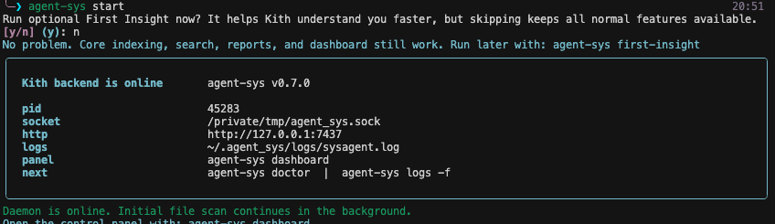
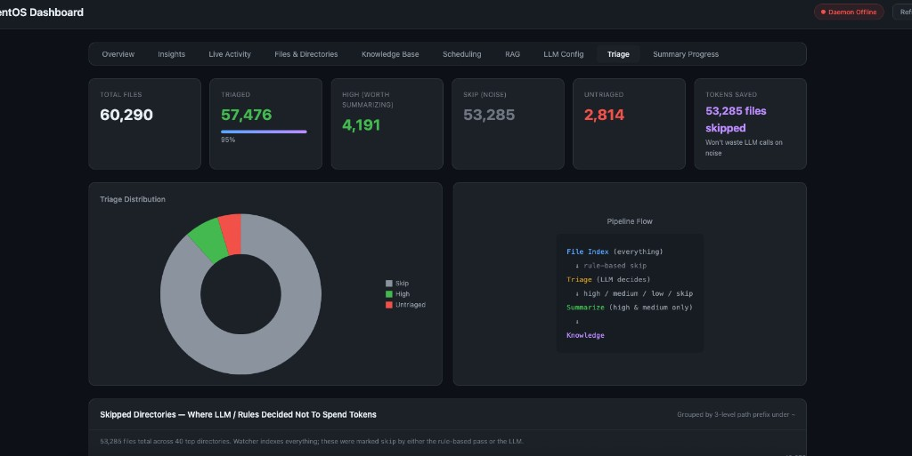
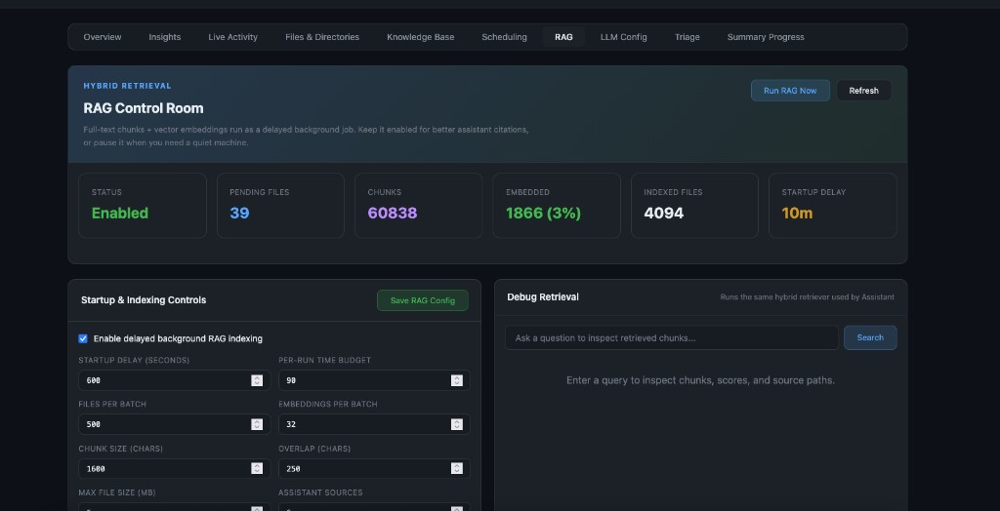
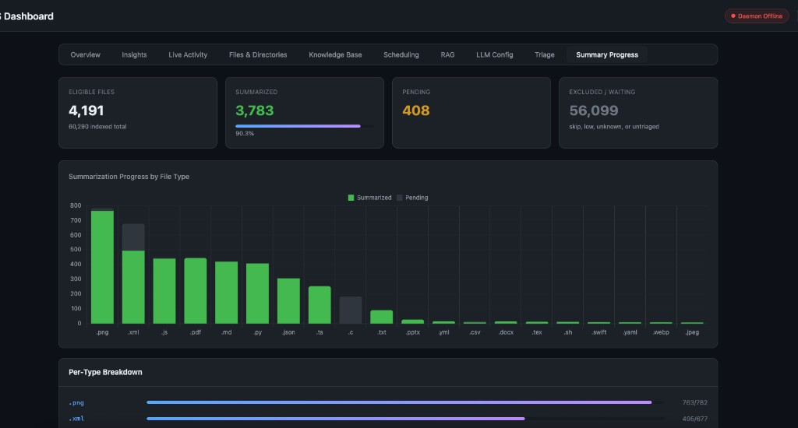
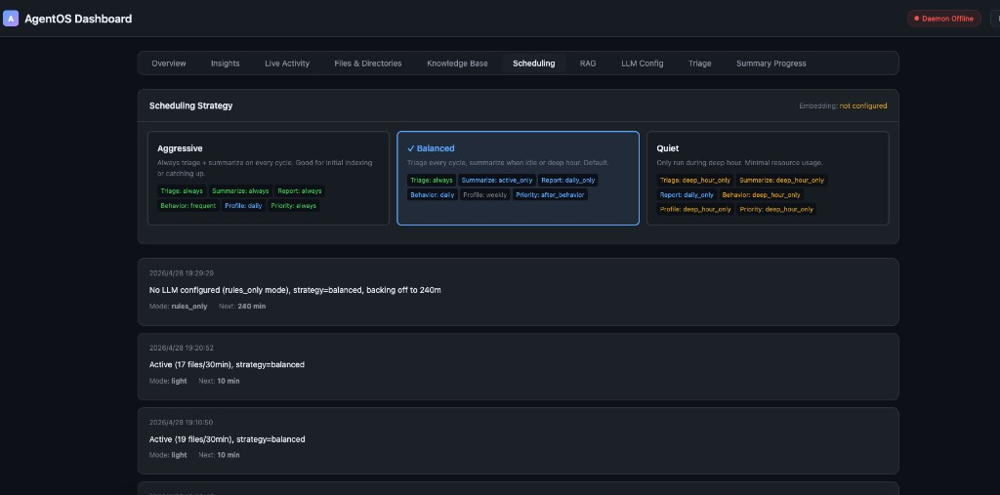

<p align="center">
  
</p>

# KithAgent

**Languages / 语言:** [English](#english) · [中文](#中文)

> Status: early and changing. APIs, config, and CLI may move before 1.0.

---

## English

KithAgent is a backend-first personal memory system. You choose local knowledge scopes, Kith indexes them, lets LLMs decide what is worth understanding, summarizes the important parts, builds RAG, and exposes everything to your tools through a local daemon API.

It is not trying to be another chat UI. The point is to give Cursor, Claude Code, Codex, custom agents, and your own scripts a durable local memory layer.

### Why Kith

Most memory products ask you to upload notes, paste context, or trust a cloud profile. Kith starts from your actual local computer.

- You choose the scan roots: a project folder, Documents, Downloads, Desktop, or broader local scopes.
- Kith triages first: LLMs decide which files are high-signal, low-signal, or noise.
- Summaries respect triage: important files get understood first; generated/vendor/cache files are skipped or down-ranked.
- It learns working patterns: recent focus, active folders, personal profile, recurring interests, and next-step suggestions.
- It builds hybrid retrieval: exact file lookup for known targets, RAG for broad questions.
- It is model-flexible: local Ollama or OpenAI-compatible/Anthropic/OpenAI APIs.
- It exposes syscalls and skills so other agents can ask what you have, what you are doing, and what matters next.

### How It Works

```text
local files you choose
        ↓
filesystem index
        ↓
LLM triage: high / medium / low / skip
        ↓
summaries + profile facts + behavior signals
        ↓
hybrid RAG + SQLite memory
        ↓
CLI / dashboard / skills / syscall API
```

### What Makes It Different

**Compared with Hermes-style agents:** Hermes is a general agent shell: chat, tools, sessions, automations, gateways. Kith is the local memory backend those agents can lean on.

**Compared with cloud memory:** Kith lets you pick local source scopes and run the memory pipeline on your machine. The durable store is local SQLite under `~/.agent_sys/`.

**Compared with simple file search:** Kith does not sort by filename or size only. It asks LLMs which files reveal your projects, habits, interests, and priorities, then spends summarization/RAG budget there first.

### Screenshots

<p align="center">
  
  
</p>
<p align="center">
  
  
</p>
<p align="center">
  
</p>

### Quick Start

```bash
git clone https://github.com/MarkfuGod/KithAgent.git
cd KithAgent

pip install -e ".[full]"
agent-sys start
```

Useful commands:

```bash
agent-sys                 # command center
agent-sys doctor          # health check
agent-sys dashboard       # browser control panel
agent-sys first-insight   # optional: help Kith understand you faster
agent-sys logs -f         # follow daemon logs
agent-sys status          # readable backend status
agent-sys search "notes"  # search indexed files
agent-sys report brief    # short context brief for a new agent session
```

First Insight is optional. It accelerates personalization, but normal indexing, search, dashboard, reports, and syscalls work without it.

### Dashboard

```bash
agent-sys dashboard
```

The dashboard is the control panel for:

- scan roots and source scope
- model/API/Ollama settings
- triage distribution and file cluster decisions
- RAG indexing status and debug retrieval
- live daemon activity
- memory/profile review

### Agent Integrations

Kith ships skills under `skills/`:

- `agent-sys-user-context`: ask what the user has been doing, what they care about, and what to prioritize.
- `agent-sys-file-search`: search local indexed files and retrieve citation-ready evidence.
- `agent-sys-admin`: inspect daemon status, run triage/RAG manually, and debug setup.

Install into Cursor:

```bash
mkdir -p ~/.cursor/skills
for s in agent-sys-user-context agent-sys-file-search agent-sys-admin; do
  ln -sfn "$(pwd)/skills/$s" "$HOME/.cursor/skills/$s"
done
```

Claude Code uses the same skill format under `~/.claude/skills/`.

### API

Kith exposes a local syscall API over Unix socket and HTTP.

```python
from agent_sys.syscall.client import SysAgentClient

async with SysAgentClient(caller="cursor") as client:
    brief = await client.report_brief()
    profile = await client.profile_get()
    files = await client.file_search("project plan")
```

HTTP health endpoints:

```bash
curl http://127.0.0.1:7437/health
curl http://127.0.0.1:7437/status
```

Authenticated syscalls use `X-Agent-Token: $(cat ~/.agent_sys/auth_token)`.

### Storage And Privacy

Kith stores runtime data locally:

- `~/.agent_sys/memory.db`: SQLite memory, file index, summaries, RAG chunks, profile facts.
- `~/.agent_sys/scan_config.yaml`: selected scan roots.
- `~/.agent_sys/llm_config.yaml`: model settings.
- `~/.agent_sys/auth_token`: local HTTP syscall token.
- `~/.agent_sys/logs/sysagent.log`: daemon logs.

Browser metadata ingestion is optional and scoped. It does not read cookies, login databases, sessions, passwords, or tokens.

### Project Shape

```text
src/
  cli.py                 # agent-sys CLI
  kernel/daemon.py       # daemon lifecycle
  kernel/cron.py         # adaptive background scheduling
  filesystem/watcher.py  # local file indexing
  agents/triage.py       # LLM file triage
  agents/summarizer.py   # multimodal summaries
  agents/rag_indexer.py  # hybrid RAG indexing
  agents/assistant.py    # profile/memory/RAG facade
  memory/store.py        # SQLite memory store
  syscall/server.py      # socket + HTTP API
  syscall/client.py      # Python client SDK
skills/                  # integrations for external agents
desktop/                 # Electron companion app
```

---

## 中文

KithAgent 是一个后端优先的本地记忆系统。你选择本地知识范围，Kith 扫描这些文件，让 LLM 判断哪些值得理解、哪些应该跳过，再总结高价值内容、建立 RAG、形成用户画像，并通过本地 daemon API 提供给你的 Agent 工具调用。

它不是要再做一个聊天界面。它的核心价值是：给 Cursor、Claude Code、Codex、自定义 agent 和脚本一个稳定的本地记忆层。

### 为什么需要 Kith

很多 memory 产品需要你上传资料、手动粘贴上下文，或者把“你是谁”交给云端。Kith 从你真实的本地电脑开始。

- 你自己选择扫描范围：项目目录、Documents、Downloads、Desktop，或更大的本地范围。
- 先分诊再理解：LLM 判断文件是高价值、中等价值、低价值还是噪音。
- 总结尊重分诊：重要文件优先理解，生成物、依赖库、缓存会被跳过或降权。
- 记录电脑使用习惯：近期关注、活跃目录、用户画像、兴趣变化和下一步建议。
- 混合检索：明确目标用精确查找，宽泛问题用 RAG。
- 模型可配置：本地 Ollama 或 OpenAI-compatible / Anthropic / OpenAI API。
- 对外开放接口和 Skills：其他 Agent 可以直接问你有什么、在做什么、下一步该做什么。

### 它怎么工作

```text
你选择的本地文件
        ↓
文件索引
        ↓
LLM 分诊：high / medium / low / skip
        ↓
摘要 + 画像事实 + 行为信号
        ↓
混合 RAG + SQLite 记忆库
        ↓
CLI / dashboard / skills / syscall API
```

### 和其他东西的不同

**和 Hermes 这类 Agent Shell 不同：** Hermes 更像通用 agent 入口，强调聊天、工具、会话、自动化和 gateway。Kith 是这些 agent 背后的本地记忆后端。

**和 Cloud Memory 不同：** Kith 让你自己选择本地来源范围，记忆库默认在本机 `~/.agent_sys/` 下。

**和普通文件搜索不同：** Kith 不只是按文件名、大小、时间排序。它让 LLM 判断哪些文件真正能体现你的项目、习惯、兴趣和优先级，再优先花 token 理解这些文件。

### 截图

<p align="center">
  
  
</p>
<p align="center">
  
  
</p>
<p align="center">
  
</p>

### 快速开始

```bash
git clone https://github.com/MarkfuGod/KithAgent.git
cd KithAgent

pip install -e ".[full]"
agent-sys start
```

常用命令：

```bash
agent-sys                 # 命令中心
agent-sys doctor          # 健康检查
agent-sys dashboard       # 浏览器控制面板
agent-sys first-insight   # 可选：帮助 Kith 更快理解你
agent-sys logs -f         # 实时查看 daemon 日志
agent-sys status          # 可读后端状态
agent-sys search "notes"  # 搜索已索引文件
agent-sys report brief    # 给新 agent 会话的简短上下文
```

First Insight 是可选的。它能加速个性化，但不做也不影响索引、搜索、dashboard、报告和 syscall。

### Dashboard

```bash
agent-sys dashboard
```

Dashboard 是控制面板，可以管理：

- 扫描范围和资料来源
- 模型 / API / Ollama 设置
- 文件分诊分布和文件簇决策
- RAG 索引状态和 debug retrieval
- daemon 实时活动
- 记忆和用户画像校正

### 接入其他 Agent

Kith 自带 `skills/`：

- `agent-sys-user-context`：让 agent 获取你的近期状态、兴趣和优先级。
- `agent-sys-file-search`：搜索本地已索引文件，拿到可引用证据。
- `agent-sys-admin`：检查 daemon、手动触发 triage/RAG、调试配置。

安装到 Cursor：

```bash
mkdir -p ~/.cursor/skills
for s in agent-sys-user-context agent-sys-file-search agent-sys-admin; do
  ln -sfn "$(pwd)/skills/$s" "$HOME/.cursor/skills/$s"
done
```

Claude Code 也使用同样的 skill 格式，目录是 `~/.claude/skills/`。

### API

Kith 通过 Unix socket 和 HTTP 暴露本地 syscall API。

```python
from agent_sys.syscall.client import SysAgentClient

async with SysAgentClient(caller="cursor") as client:
    brief = await client.report_brief()
    profile = await client.profile_get()
    files = await client.file_search("project plan")
```

HTTP health：

```bash
curl http://127.0.0.1:7437/health
curl http://127.0.0.1:7437/status
```

调用 `/syscall` 需要 `X-Agent-Token: $(cat ~/.agent_sys/auth_token)`。

### 本地存储和隐私

Kith 的运行数据默认在本机：

- `~/.agent_sys/memory.db`：SQLite 记忆库、文件索引、摘要、RAG chunks、画像事实。
- `~/.agent_sys/scan_config.yaml`：你选择的扫描范围。
- `~/.agent_sys/llm_config.yaml`：模型设置。
- `~/.agent_sys/auth_token`：本地 HTTP syscall token。
- `~/.agent_sys/logs/sysagent.log`：daemon 日志。

浏览器 metadata 摄取是可选的，而且只读标题、域名、书签、下载 metadata 等聚合信息；不读取 cookies、登录数据库、session、密码或 token。

### 项目结构

```text
src/
  cli.py                 # agent-sys CLI
  kernel/daemon.py       # daemon 生命周期
  kernel/cron.py         # 自适应后台调度
  filesystem/watcher.py  # 本地文件索引
  agents/triage.py       # LLM 文件分诊
  agents/summarizer.py   # 多模态摘要
  agents/rag_indexer.py  # 混合 RAG 索引
  agents/assistant.py    # 画像 / 记忆 / RAG facade
  memory/store.py        # SQLite memory store
  syscall/server.py      # socket + HTTP API
  syscall/client.py      # Python client SDK
skills/                  # 外部 agent integrations
desktop/                 # Electron 伴侣应用
```
