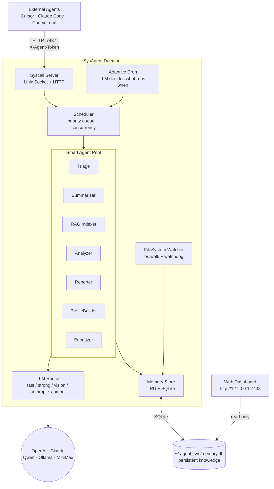
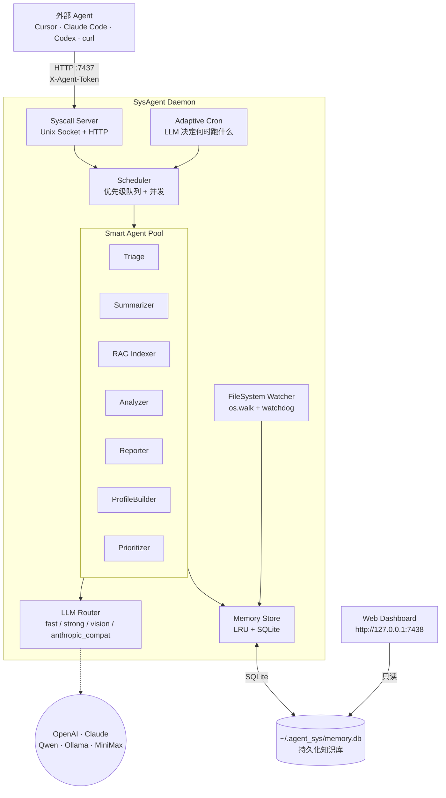

<p align="center">
  
</p>

# agent-sys

<p align="center"><em>codename: <strong>Kith / 契</strong></em><br/>
<sub>— a quiet familiar your agents can lean on · 一个熟稔到懂你的后台守护</sub></p>

**Languages / 语言:** [English](#english) · [中文](#chinese)

> **Status: under active development / 正在积极开发中.**
> Feedback, bug reports and ideas welcome on [GitHub Issues](https://github.com/MarkfuGod/KithAgent/issues) —— 欢迎到 [Issues](https://github.com/MarkfuGod/KithAgent/issues) 反馈。APIs / config / CLI may keep changing until 1.0；API、配置、CLI 在 1.0 前都可能继续变化。

---


## English

[jump to 中文 ↓](#chinese)

**A long-running local daemon that indexes your files and exposes an LLM-powered RPC surface.**

agent-sys runs in the background, continuously indexing directories you choose (defaults are `~/Documents` and `~/Desktop`; the first launch lets you confirm / edit), uses LLMs to tag, summarize, extract knowledge, and build a hybrid RAG index over useful files, then exposes a query API over Unix socket / HTTP.

When you're using an agent tool like Cursor or Claude Code, it can call agent-sys to get context about your local files and working habits — no need to re-scan from scratch every session.

### Architecture at a glance




| Module              | What it actually is                                                       | OS analogue       |
| ------------------- | ------------------------------------------------------------------------- | ----------------- |
| `SysAgentKernel`    | Daemon entry point, manages subsystem lifecycle                           | Kernel / init     |
| `AgentTask`         | Smallest unit of work the scheduler consumes                              | Thread            |
| `AgentScheduler`    | Priority queue + semaphore + per-task timeout                             | Process scheduler |
| `FileSystemWatcher` | `os.walk` bulk scan + `watchdog` incremental                              | VFS               |
| `MemoryStore`       | LRU hot cache + SQLite cold store                                         | RAM / disk        |
| `SyscallServer`     | Unix socket / HTTP RPC surface; HTTP is easier for external agents        | Syscalls          |
| `CronScheduler`     | LLM-driven policy engine with rule-based fallback                         | Cron              |
| `RagIndexerAgent`   | Delayed chunking + FTS + vector embeddings for citation-backed answers    | Search indexer    |


### Quick start

```bash
# Clone & install
git clone https://github.com/MarkfuGod/KithAgent.git agent_sys
cd agent_sys
pip install -e ".[full]"

# Multimodal extras (PDF / Word parsing)
pip install PyMuPDF python-docx

# Start (first run prompts for LLM API keys; config is persisted)
agent-sys start

# Or detach as a background daemon
agent-sys start -d

# If a daemon is already running, `start` refuses (avoids cross-terminal kills)
agent-sys start          # → "already running (PID xxx), use 'agent-sys stop' first"
agent-sys start --force  # → explicit override, SIGTERM the old process first
```

### Desktop companion app

The `desktop/` folder contains a Mac-first Electron companion for the same local daemon. It gives non-developer users a warm Kith surface without asking them to run curl or remember syscall names.

```bash
cd desktop
npm install
npm run dev       # Vite renderer + Electron shell
npm test          # Node tests for daemon bridge
npm run typecheck
```

The desktop app:

- starts `agent-sys start -d` automatically if the daemon is not already running
- talks to `127.0.0.1:7437` with `X-Agent-Token`, falling back to the Unix socket
- exposes **Ask Kith**, **About Me**, **Memories**, **Sources & Privacy**, and **Advanced** tabs
- lets users correct profile facts (`confirmed`, `rejected`, `hidden`)
- lets users edit scan roots and model settings from the UI
- opens the raw dashboard for deeper debugging

Set `AGENT_SYS_PYTHON=/path/to/python` if Electron should use a specific Python environment to launch the daemon.

### Plugging into AI agents — the `skills/` folder

The repo root has a `skills/` folder with three skills; each is a single `SKILL.md` with YAML frontmatter. This is Anthropic's [Agent Skills](https://www.anthropic.com/engineering/equipping-agents-for-the-real-world-with-agent-skills) format, **natively supported by Cursor and Claude Code**. Other tools (Codex, Windsurf, Cline, etc.) can read the same files as regular instruction markdown.

The three skills:


| Skill                    | When it triggers                                                                   | Syscalls it uses                                    |
| ------------------------ | ---------------------------------------------------------------------------------- | --------------------------------------------------- |
| `agent-sys-user-context` | "based on what you know about me", "what have I been working on", "do you know me" | `assistant.chat` / `report.brief` / `profile.get` / `analyze.behavior` |
| `agent-sys-file-search`  | "find the notes I wrote about X", "look across my disk for Y"                      | `file.search` / `file.read` / `knowledge.query` / `assistant.chat` |
| `agent-sys-admin`        | "is the daemon up", "re-run triage/RAG manually", "switch models"                  | `agent-sys` CLI + `/status` + `agent.submit`        |


#### Cursor

Symlink the three skills into `~/.cursor/skills/`, then restart Cursor:

```bash
mkdir -p ~/.cursor/skills
for s in agent-sys-user-context agent-sys-file-search agent-sys-admin; do
  ln -sfn "$(pwd)/skills/$s" "$HOME/.cursor/skills/$s"
done
```

For a frozen snapshot (not tracking the repo) swap `ln -sfn` for `cp -r`.

#### Claude Code

Claude Code's skill directory is `~/.claude/skills/`, same format:

```bash
mkdir -p ~/.claude/skills
for s in agent-sys-user-context agent-sys-file-search agent-sys-admin; do
  ln -sfn "$(pwd)/skills/$s" "$HOME/.claude/skills/$s"
done
```

If your Claude Code build doesn't recognize `~/.claude/skills/` yet, concatenate the `SKILL.md` contents into your project's `CLAUDE.md` (or `~/.claude/CLAUDE.md`) instead — the effect is identical.

#### Codex CLI / anything using `AGENTS.md`

Codex, Aider and other tools read a single `AGENTS.md` instruction file. Concatenate the skills:

```bash
cat skills/agent-sys-*/SKILL.md > AGENTS.md
# Global: cat skills/agent-sys-*/SKILL.md > ~/.codex/AGENTS.md
```

YAML frontmatter is harmless inside markdown and can stay; if you want it cleaner, delete the `---` blocks at the top of each section manually.

#### Generic fallback

If your agent doesn't support any of the above formats, just feed `skills/*/SKILL.md` in as a system prompt / context. The three files are self-contained with trigger notes and curl examples.

#### Try it

With the daemon running, say something like this to your agent:

> Based on what I've been doing this past week, help me plan priorities for this week.

The agent will auto-load `agent-sys-user-context`, run `curl -H "X-Agent-Token: $(cat ~/.agent_sys/auth_token)" http://127.0.0.1:7437/syscall ...` to fetch your brief, and answer from the real you instead of guessing.

### Hybrid RAG & multimodal evidence

After startup and First Insight stay fast, Kith starts a delayed low-priority `rag_indexer` job. It chunks high / medium triaged files into `document_chunks`, writes a SQLite FTS index, and computes vector embeddings when an embedding provider is available. The consumer `assistant.chat` surface uses the same hybrid retriever and returns citation-ready sources like `S1`, `S2`.

RAG now handles more than plain text:

- Text, code, Markdown, PDFs with selectable text, and Office documents become line-aware chunks.
- Images become media chunks using the file's semantic summary plus the original image for embedding.
- Image-only PDFs render the first page to a PNG data URI, so scanned PDFs can still be retrieved as visual evidence.
- Result metadata includes `modality`, `source_kind`, `page`, `frame_time_ms`, and line ranges when available.

Default embedding config uses DashScope's multimodal model:

```yaml
memory:
  embedding:
    provider: dashscope
    api_key_env: DASHSCOPE_API_KEY
    api_base_url: https://dashscope.aliyuncs.com/compatible-mode/v1
    model: qwen3-vl-embedding
    dimensions: 0  # provider default; code sends 1024 when required by DashScope
```

If the embedding key is missing, RAG still builds chunks and FTS search; vector recall starts once embeddings are available. Use the dashboard's **RAG** tab to see pending files, embedded chunks, logs, debug retrieval, and to run the indexer manually.

### First Insight onboarding

Kith's consumer path is optimized for **Time to First Insight**: a first useful profile in minutes, before full summarization or embeddings finish.

The product-level syscall is `assistant.first_insight` (alias: `onboarding.bootstrap`). It combines:

- explicit onboarding answers: role, goals, current focus, suggestion cadence, and content boundaries
- recent file metadata and active folder shape
- optional Chromium-family browser metadata: History titles/domains, Bookmarks, and Downloads metadata
- correctable memory stored in `profile_facts`
- provenance stored in `source_records`
- run telemetry stored in `insight_runs` / `insight_items`

Privacy boundary: browser ingestion does **not** read Cookies, Login Data, sessions, passwords, or tokens. URLs are sanitized by stripping query strings and fragments before they are used.

The intended first-run flow is: ask 5 lightweight questions, request source consent, run First Insight, show “what I think I understand”, recent themes, 3-5 suggestions, and let the user mark each memory as accurate / inaccurate / hidden.

### Source scope, memory review, and model settings

Kith stores user-facing preferences under `~/.agent_sys/` with restrictive file permissions:

- `scan_config.yaml` — normalized source directories selected by the user
- `llm_config.yaml` — model mode/provider/base URL/API key env overrides

The consumer syscall surface behind the desktop app is:

| Syscall | Purpose |
| --- | --- |
| `assistant.chat` | Ask Kith using profile, reports, recent files, and RAG evidence |
| `profile.summary` | Fetch or rebuild the current user profile + correctable facts |
| `memory.review` | List remembered facts and knowledge snippets |
| `memory.feedback` | Mark a fact `confirmed`, `rejected`, or `hidden` |
| `sources.get` | Read current scan roots |
| `sources.configure` | Save scan roots and prune out-of-scope indexed files |
| `settings.model` | Save API / Ollama / local model settings and hot-reload config when possible |

### Web dashboard

```bash
agent-sys dashboard                 # serves http://127.0.0.1:7438
agent-sys dashboard --port 9000     # custom port
```

**Nine tabs:**

- **Overview** — total files, summarization progress, knowledge entries, daemon status, file-type pie chart, priority bars, recent modifications
- **Live Activity** — live daemon events including RAG starts / completions
- **Files & Directories** — file search + stacked bar chart of directory composition
- **Knowledge Base** — browse reports, analyses, and scheduling decisions by category
- **Scheduling** — history of adaptive scheduling decisions
- **RAG** — delayed background indexing controls, chunk/embedding stats, debug retrieval, and RAG logs
- **LLM Config** — visually edit provider / model / API key and embedding settings
- **Triage** — triage distribution chart, skipped directories, file cluster recommendations, pipeline flow, and state descriptions
- **Summary Progress** — summarization progress by file type

The dashboard reads SQLite directly, so **it works even when the daemon is stopped**.

File cluster recommendations group indexed paths by home-relative prefixes before summarization spends tokens. The dashboard can promote or exclude a whole cluster by writing `high`, `medium`, `low`, or `skip` back to matching `file_index.triage_status` rows.

### Smart agent features

Once started, the daemon runs these agents in the background under adaptive LLM scheduling:

#### Smart triage (v0.4+, mission-driven rework in v0.6)

```bash
agent-sys triage                    # run LLM triage
agent-sys triage --batch-size 1000  # bulk mode
```

Solves the core problem: out of 210k files, most third-party library sources don't justify spending LLM tokens on. v0.6 splits "filter" from "rank" — filtering uses rules, ranking uses **mission + user intent**.

- **Phase 1 — rule-based fast skip (zero LLM cost):** path substrings listed under `triage.skip_path_patterns` in `config/default.yaml` (e.g. `site-packages/`, `.cursor/extensions/`, `node_modules/`) are marked `skip` immediately.
- **Phase 2 — weighted ranking + LLM semantic triage:**
  - `triage.file_type_priority` determines "who gets analyzed first" (`.md=9 .docx=9 .py=7 .txt=3 .csv=2`) — when token budget is limited, higher-priority types are judged first.
  - `triage.hints` injects natural-language preferences into the LLM prompt (e.g. "my txt files are usually throwaway drafts").
  - The LLM batches by directory and picks one of four labels:
    - `high` — user-authored code, personal documents, study notes, personalized configs
    - `medium` — dependency configs, data files, project scaffolding
    - `low` — generic library code, standard templates
    - `skip` — third-party source, generated artifacts, raw datasets
- **Preferences ≠ hard rules:** `.txt` is low-priority by default, but a file named `journal.txt` can still be judged `high` by the LLM. Preferences only influence ordering and edge-case breaks; semantic judgment wins.
- The summarizer honors triage results: it processes `high` → `medium` first and skips `skip` / `low` entirely.

**Tuning preferences:** edit the `triage:` block in `config/default.yaml`:

```yaml
triage:
  file_type_priority:
    .md: 9       # I mostly write notes in markdown
    .py: 8       # Python projects come next
    .txt: 2      # txt is usually noise
  hints:
    - "PDFs in Downloads are usually study material worth summarizing"
    - "python files starting with test_ are tests and can be down-ranked"
```

#### File summarization (Summarizer)

```bash
agent-sys summarize                 # manual run, prints each summary
agent-sys summarize --batch-size 50
```

- Handles **code** (content + LLM summary), **documents** (PDF / DOCX text extraction), **images** (vision model).
- Incremental: 30 files per batch, split across code / doc / image proportionally; it resumes automatically next run.
- Two modes: `deep` (reads file content — suited for nighttime) and `light` (metadata only — suited for daytime).
- **Respects triage:** only summarizes `high` / `medium` / untriaged files.

#### Hybrid RAG (RagIndexer)

The RAG indexer runs in the background after the initial startup delay and can also be triggered from the dashboard's **RAG** tab.

- Builds line-aware text chunks plus media chunks for images and scanned PDFs.
- Stores chunks in SQLite (`document_chunks`) with an FTS5 index and optional vector embeddings.
- Uses `memory.rag.allowed_triage_statuses` (default: `high`, `medium`) so dependency noise does not dominate retrieval.
- Feeds `assistant.chat` with top evidence; answers can cite retrieved sources as `[S1]`, `[S2]`, etc.

#### Behavior analysis (Analyzer)

```bash
agent-sys analyze                   # full analysis (default: last 7 days)
agent-sys analyze --hours 24        # last 24h
```

Cross-cuts three dimensions: **work** (code projects, language preferences), **learning** (docs, tutorials), **personal life** (downloads, images).

#### Reports (Reporter)

```bash
agent-sys report daily              # daily report across work / learning / life
agent-sys report brief              # context brief (drop into new agent sessions)
agent-sys report project            # per-project portrait
```

#### Personal profile (Profile)

```bash
agent-sys profile                   # full LLM-built personal profile
```

#### Priority classification (Prioritizer)

```bash
agent-sys classify                  # P0 hot / P1 warm / P2 cold, grouped by code / doc / image
```

#### Browse past reports

```bash
agent-sys query --category daily_report        # daily reports
agent-sys query --category quick_report        # quick reports
agent-sys query --category context_brief       # context briefs
agent-sys query --category behavior_insight    # behavior analysis output
agent-sys query --category scheduling_decision # scheduling decisions
agent-sys query --category project_summary     # project-level summaries
```

### System status

```bash
agent-sys ping                      # is the daemon alive
agent-sys status                    # detailed status (scan progress, indexed files, etc.)
agent-sys stop                      # stop the daemon
```

### Calling agent-sys from external code

> The public import prefix is `agent_sys` (the source tree lives in `src/` and is re-exposed via a thin `agent_sys` shim package; `from agent_sys.syscall.client import ...` and `from src.syscall.client import ...` point at the same code).

#### Python SDK (async)

```python
from agent_sys.syscall.client import SysAgentClient

async with SysAgentClient(caller="cursor") as client:
    results = await client.file_search("database migration")
    analysis = await client.analyze_behavior(hours=24)
    profile = await client.profile_get()
    brief = await client.report_brief()
    triage = await client.triage_files(batch_size=500)

    await client.context_save("session-abc", {"topic": "refactoring auth"})
    ctx = await client.context_load("session-abc")
```

#### Python SDK (sync)

```python
from agent_sys.syscall.client import SyncSysAgentClient

with SyncSysAgentClient(caller="my_plugin") as client:
    results = client.file_search("config parser")
    profile = client.profile_get()
```

#### HTTP API

`/health` and `/status` are open. Every call to `/syscall` requires
`X-Agent-Token: $(cat ~/.agent_sys/auth_token)`.

```bash
curl http://127.0.0.1:7437/health
curl http://127.0.0.1:7437/status

TOKEN=$(cat ~/.agent_sys/auth_token)
curl -X POST http://127.0.0.1:7437/syscall \
  -H "Content-Type: application/json" \
  -H "X-Agent-Token: $TOKEN" \
  -d '{"call_type": "triage.files", "params": {"batch_size": 500}, "caller": "curl"}'
```

### LLM configuration

Four provider types are supported:


| Provider               | Purpose                                                 | Config                            |
| ---------------------- | ------------------------------------------------------- | --------------------------------- |
| `openai`               | OpenAI official API                                     | `OPENAI_API_KEY`                  |
| `claude`               | Anthropic Claude API                                    | `ANTHROPIC_API_KEY`               |
| `anthropic_compatible` | Anthropic-compatible API (e.g. MiniMax)                 | `ANTHROPIC_API_KEY` + `base_url`  |
| `compatible`           | OpenAI-compatible API (DeepSeek / Ollama / Qwen / etc.) | `COMPATIBLE_API_KEY` + `base_url` |


Pick any of:

1. **First launch** — `agent-sys start` walks you through an interactive setup.
2. **Web dashboard** — `agent-sys dashboard` → LLM Config tab.
3. **Manual edit** — `~/.agent_sys/llm_config.yaml`.

### Writing your own agent

```python
from agent_sys.agents.base import BaseAgent, AgentTask

class MyCustomAgent(BaseAgent):
    name = "my_custom_task"

    async def execute(self, task: AgentTask, context: dict) -> dict:
        memory = context["memory"]
        llm = context["llm"]
        # your logic here
        return {"result": "done"}

# Register with the scheduler
scheduler.register_agent(MyCustomAgent())
```

### Project layout

```
agent_sys/
├── config/
│   └── default.yaml              # master config (LLM + cron + adaptive + triage)
├── desktop/                      # Electron + React companion app
│   ├── src/main/                 # daemon bridge + Electron main process
│   ├── src/preload/              # safe IPC surface exposed to renderer
│   ├── src/renderer/             # Kith UI
│   └── test/                     # desktop daemon bridge tests
├── skills/                       # drop-in skills for Cursor / Claude Code / Codex
│   ├── agent-sys-user-context/
│   ├── agent-sys-file-search/
│   └── agent-sys-admin/
├── src/
│   ├── kernel/                   # kernel layer
│   │   ├── daemon.py             # daemon main loop
│   │   ├── config.py             # config loader (incl. AdaptiveConfig)
│   │   └── cron.py               # LLM-adaptive scheduler (incl. triage pipeline)
│   ├── llm/                      # unified LLM abstraction
│   │   ├── base.py               # LLMProvider interface (multimodal-aware)
│   │   ├── openai_adapter.py
│   │   ├── claude_adapter.py     # Claude + AnthropicCompatibleAdapter
│   │   ├── compatible_adapter.py # OpenAI-compatible APIs
│   │   └── router.py             # task → model routing
│   ├── filesystem/
│   │   └── watcher.py            # os.walk bulk scan + watchdog realtime
│   ├── memory/
│   │   ├── chunking.py           # deterministic text chunking for RAG
│   │   ├── embeddings.py         # local / OpenAI / DashScope embeddings
│   │   └── store.py              # SQLite, chunks, FTS, vector search
│   ├── scheduler/
│   │   └── pool.py               # priority queue + concurrency pool
│   ├── syscall/
│   │   ├── protocol.py           # syscall types (RPC endpoints)
│   │   ├── server.py             # socket/HTTP server
│   │   └── client.py             # async + sync client SDKs
│   ├── agents/
│   │   ├── base.py               # AgentTask + BaseAgent
│   │   ├── builtin.py            # registers built-in daemon agents
│   │   ├── triage.py             # LLM-assisted file triage (rules + LLM)
│   │   ├── summarizer.py         # multimodal summaries (respects triage)
│   │   ├── rag_indexer.py        # hybrid chunk / FTS / vector RAG indexer
│   │   ├── assistant.py          # consumer assistant facade with RAG evidence
│   │   ├── analyzer.py           # holistic behavior analysis
│   │   ├── prioritizer.py        # file priority classification
│   │   ├── reporter.py           # multi-facet reports
│   │   └── profile_builder.py    # full personal profile
│   ├── web/                      # web dashboard
│   │   ├── dashboard.py          # aiohttp app composition
│   │   ├── api/                  # grouped dashboard APIs
│   │   ├── static/               # dashboard JS/CSS assets
│   │   └── dashboard.html        # dark-theme SPA (9 tabs)
│   ├── extractors.py             # PDF / DOCX / image/scanned-PDF extraction
│   └── cli.py                    # CLI entry point
├── pyproject.toml
├── requirements.txt
└── README.md
```

### Design philosophy

In a conventional computer, the CPU uses a scheduler to dispatch threads to handle deterministic computation. In AgentOS, **the LLM uses a scheduler to dispatch agent threads to handle fuzzy, understanding-shaped tasks.**

Key differences:

- OS threads run deterministic compute → agent threads run tasks that need interpretation.
- OS file systems store bytes → AgentOS stores **understood** data.
- OS syscalls are synchronous function calls → AgentOS syscalls are async message passing.
- OS memory is byte-addressable → AgentOS memory is semantic-addressable (retrieval by meaning).
- OS cron runs a fixed schedule → AgentOS cron is **LLM-adaptive**.
- OS treats every file equally → AgentOS **triages** first and only deeply understands what's worth understanding.

Not a replacement for the operating system — an **agent-native runtime layer** sitting on top of one.

### Contributing

This project is under active development. Issues, bug reports, and pull requests are all welcome:

- Issues: [https://github.com/MarkfuGod/KithAgent/issues](https://github.com/MarkfuGod/KithAgent/issues)
- Repo: [https://github.com/MarkfuGod/KithAgent](https://github.com/MarkfuGod/KithAgent)

[↑ back to top](#agent-sys) · [switch to 中文 ↓](#chinese)

---


## 中文

[jump to English ↑](#english)

**一个常驻本地的文件索引 + LLM RPC 守护进程。**

agent-sys 在后台持续索引你选择的目录（默认 `~/Documents` 和 `~/Desktop`，首次启动会让你确认/修改），用 LLM 为文件打标签、做摘要、抽取知识，并为有价值的文件构建混合 RAG 索引，再通过 Unix Socket / HTTP 暴露一套查询接口。

当你用 Cursor、Claude Code 这类 Agent 工具时，它们可以直接调用 agent-sys，拿到关于你本地文件和工作习惯的上下文，而不必每次从零开始扫。


### 模块速览




| 模块                  | 实际是什么                                                | OS 比喻         |
| ------------------- | ---------------------------------------------------- | ------------- |
| `SysAgentKernel`    | 守护进程主入口，负责子系统生命周期                                    | Kernel / init |
| `AgentTask`         | 调度器吃的最小工作单元                                          | Thread        |
| `AgentScheduler`    | 优先级队列 + semaphore + per-task timeout                 | 进程调度器         |
| `FileSystemWatcher` | `os.walk` 首次扫描 + `watchdog` 监听增量                     | VFS           |
| `MemoryStore`       | LRU 热缓存 + SQLite 冷存储                                 | 内存/磁盘         |
| `SyscallServer`     | Unix Socket / HTTP RPC 接口，外部 agent 通常用 HTTP 更方便             | 系统调用          |
| `CronScheduler`     | LLM 驱动的策略引擎 + 规则 fallback，决定"何时跑哪个 agent"            | Cron          |
| `RagIndexerAgent`   | 延迟执行的 chunk、FTS、向量 embedding 索引，用来支撑带引用的回答            | 搜索索引器         |


### 快速开始

```bash
# 克隆 & 安装
git clone https://github.com/MarkfuGod/KithAgent.git agent_sys
cd agent_sys
pip install -e ".[full]"

# 安装多模态依赖（PDF/Word 文件解析）
pip install PyMuPDF python-docx

# 启动（首次会提示配置 LLM API Key，配置后自动持久化）
agent-sys start

# 或作为后台守护进程启动
agent-sys start -d

# 检测到已有 daemon 时，start 会拒绝启动（避免多 terminal 误杀）
agent-sys start          # → "already running (PID xxx), use 'agent-sys stop' first"
agent-sys start --force  # → 显式覆盖，SIGTERM 旧进程后启动新的
```

### 桌面伴侣 App

`desktop/` 目录是基于 Electron 的 Mac 桌面伴侣，用同一个本地 daemon，但给普通用户一个温柔的 Kith 界面，不需要记 curl 或 syscall 名字。

```bash
cd desktop
npm install
npm run dev       # Vite renderer + Electron shell
npm test          # daemon bridge 的 Node 测试
npm run typecheck
```

桌面 App 会：

- daemon 未运行时自动执行 `agent-sys start -d`
- 优先用 `127.0.0.1:7437` + `X-Agent-Token`，失败时回退到 Unix socket
- 提供 **Ask Kith**、**About Me**、**Memories**、**Sources & Privacy**、**Advanced** 五个标签
- 允许用户把画像事实标记为 `confirmed`、`rejected`、`hidden`
- 允许用户在 UI 里编辑扫描范围和模型设置
- 一键打开原始 dashboard 做深度调试

如果 Electron 需要使用指定 Python 环境启动 daemon，可以设置 `AGENT_SYS_PYTHON=/path/to/python`。

### 接入 AI agent —— `skills/` 文件夹

仓库根目录 `skills/` 下放了三个 skill，每个就是一个带 YAML frontmatter 的 `SKILL.md`。这是 Anthropic 推的 [Agent Skills](https://www.anthropic.com/engineering/equipping-agents-for-the-real-world-with-agent-skills) 格式，**Cursor 和 Claude Code 原生支持**；其他工具（Codex、Windsurf、Cline 等）把它当普通 instruction markdown 读也能用。

三个 skill 的分工：


| Skill                    | 触发场景                              | 调用的 syscall                                         |
| ------------------------ | --------------------------------- | --------------------------------------------------- |
| `agent-sys-user-context` | "根据我的情况"/"最近我在做什么"/"你了解我吗"        | `assistant.chat` / `report.brief` / `profile.get` / `analyze.behavior` |
| `agent-sys-file-search`  | "找我之前写过的 X"/"硬盘里关于 Y 的笔记"         | `file.search` / `file.read` / `knowledge.query` / `assistant.chat` |
| `agent-sys-admin`        | "daemon 挂了吗"/"手动跑一次 triage/RAG"/"换模型" | `agent-sys` CLI + `/status` + `agent.submit`        |


#### Cursor

把三个 skill 软链到 `~/.cursor/skills/`，重启 Cursor 即生效：

```bash
mkdir -p ~/.cursor/skills
for s in agent-sys-user-context agent-sys-file-search agent-sys-admin; do
  ln -sfn "$(pwd)/skills/$s" "$HOME/.cursor/skills/$s"
done
```

想要固定快照（不跟仓库更新）把 `ln -sfn` 换成 `cp -r` 就行。

#### Claude Code

Claude Code 的 skill 目录是 `~/.claude/skills/`，格式完全一致：

```bash
mkdir -p ~/.claude/skills
for s in agent-sys-user-context agent-sys-file-search agent-sys-admin; do
  ln -sfn "$(pwd)/skills/$s" "$HOME/.claude/skills/$s"
done
```

如果你的 Claude Code 版本还不认 skills 目录，可以把 `SKILL.md` 的内容拼进项目根的 `CLAUDE.md` 或 `~/.claude/CLAUDE.md` 里，效果等价。

#### Codex CLI / 其他走 `AGENTS.md` 的工具

Codex、Aider 等工具读一个叫 `AGENTS.md` 的统一指令文件。把三个 skill 拼进去就行：

```bash
cat skills/agent-sys-*/SKILL.md > AGENTS.md
# 全局用：cat skills/agent-sys-*/SKILL.md > ~/.codex/AGENTS.md
```

YAML frontmatter 在 markdown 里无害，可以保留；嫌碍眼的话手动删掉每段顶上 `---` 之间的部分即可。

#### 通用兜底

如果你的 agent 不吃上面任何一种格式，把 `skills/*/SKILL.md` 直接喂给它当 system prompt / context 就行 —— 三个文件都是自包含的，并且自带触发说明和 curl 范例。

#### 试一下

daemon 运行后，在 agent 聊天框里说一句触发词：

> 根据我最近一周的情况，帮我规划下本周重点。

Agent 会自动加载 `agent-sys-user-context`，先 `curl -H "X-Agent-Token: $(cat ~/.agent_sys/auth_token)" http://127.0.0.1:7437/syscall ...` 拿 brief，再基于真实的你来回答，而不是凭空猜。

### 混合 RAG 与多模态证据

为了让启动和 First Insight 保持轻量，Kith 会在启动后一段时间再低优先级运行 `rag_indexer`。它会把 `high` / `medium` 分诊文件切成 `document_chunks`，写入 SQLite FTS 索引，并在 embedding provider 可用时计算向量。面向用户的 `assistant.chat` 会使用同一套混合检索，并返回可引用的来源编号，例如 `S1`、`S2`。

RAG 现在不只处理纯文本：

- 文本、代码、Markdown、可选中文本的 PDF、Office 文档会变成带行号范围的 chunk。
- 图片会使用文件语义摘要生成媒体 chunk，并把原图一起送入多模态 embedding。
- 图片型 / 扫描版 PDF 会先把第一页渲染成 PNG data URI，因此也能作为视觉证据被检索。
- 检索结果 metadata 会包含 `modality`、`source_kind`、`page`、`frame_time_ms`，以及可用时的行号范围。

默认 embedding 配置使用 DashScope 多模态模型：

```yaml
memory:
  embedding:
    provider: dashscope
    api_key_env: DASHSCOPE_API_KEY
    api_base_url: https://dashscope.aliyuncs.com/compatible-mode/v1
    model: qwen3-vl-embedding
    dimensions: 0  # 使用 provider 默认；DashScope 需要时代码会发送 1024
```

如果没有配置 embedding key，RAG 仍会建立 chunk 和 FTS 检索；向量召回会在 embedding 可用后开始。可以在仪表盘的 **RAG** 标签页查看待索引文件、已 embedding chunk、日志、debug retrieval，也可以手动触发索引器。

### First Insight 首次洞察

Kith 的消费端路径优先优化 **Time to First Insight**：先在几分钟内生成第一版有用画像，不等待完整总结或 embedding 全部完成。

产品级 syscall 是 `assistant.first_insight`（别名：`onboarding.bootstrap`）。它会组合：

- 用户显式回答：角色、目标、当前关注点、建议频率、内容边界
- 最近文件 metadata 和活跃文件夹形态
- 可选 Chromium 系浏览器 metadata：History 标题/域名、Bookmarks、Downloads metadata
- 存在 `profile_facts` 里的可校正记忆
- 存在 `source_records` 里的来源记录
- 存在 `insight_runs` / `insight_items` 里的运行遥测

隐私边界：浏览器摄取不会读取 Cookies、Login Data、session、密码或 token。URL 使用前会去掉 query string 和 fragment。

预期首次流程是：问 5 个轻量问题，请求资料来源授权，运行 First Insight，展示“我目前理解的是”、近期主题、3-5 条建议，并允许用户把每条记忆标成准确 / 不准确 / 隐藏。

### 资料范围、记忆校正与模型设置

Kith 会把用户可见偏好存在 `~/.agent_sys/`，并使用较严格的文件权限：

- `scan_config.yaml` — 用户选择并规范化后的资料目录
- `llm_config.yaml` — 模型模式、provider、base URL、API key 环境变量覆盖

桌面 App 背后的用户级 syscall：

| Syscall | 用途 |
| --- | --- |
| `assistant.chat` | 用画像、报告、最近文件和 RAG evidence 向 Kith 提问 |
| `profile.summary` | 获取或重建当前用户画像 + 可校正事实 |
| `memory.review` | 查看已记住的事实和知识片段 |
| `memory.feedback` | 把事实标记为 `confirmed`、`rejected` 或 `hidden` |
| `sources.get` | 读取当前扫描范围 |
| `sources.configure` | 保存扫描范围，并清理范围外的已索引文件 |
| `settings.model` | 保存 API / Ollama / local 模型设置，并尽量热重载配置 |

### Web 仪表盘

```bash
agent-sys dashboard                 # 启动 http://127.0.0.1:7438
agent-sys dashboard --port 9000     # 自定义端口
```

**9 个标签页**：

- **Overview** — 文件总量、总结进度、知识条目、daemon 状态、类型分布饼图、优先级柱图、最近修改
- **Live Activity** — daemon 实时事件，包括 RAG 开始 / 完成
- **Files & Directories** — 文件搜索 + 目录组成堆叠条形图
- **Knowledge Base** — 按 category 浏览所有报告、分析、调度决策
- **Scheduling** — 自适应调度决策历史
- **RAG** — 延迟后台索引控制、chunk/embedding 统计、debug retrieval 和 RAG 日志
- **LLM Config** — 可视化编辑 provider、模型、API key 和 embedding 配置
- **Triage** — 分诊分布图、已跳过目录、文件簇建议、pipeline 流程和状态说明
- **Summary Progress** — 按文件类型的总结进度

仪表盘直接读 SQLite，**daemon 不运行也能用**。

文件簇建议会在总结消耗 token 之前，把已索引路径按 home-relative prefix 分组。你可以在 dashboard 里把整组提升或排除，本质上会把匹配 `file_index.triage_status` 写成 `high`、`medium`、`low` 或 `skip`。

### 智能 Agent 功能

启动后 daemon 自动在后台运行以下 agent，由 LLM 自适应调度：

#### 智能分诊 — Triage（v0.4 新增，v0.6 使命驱动增强）

```bash
agent-sys triage                    # 运行 LLM 分诊
agent-sys triage --batch-size 1000  # 大批量
```

解决核心问题：21 万文件中大量第三方库源码不值得浪费 LLM token 总结。v0.6 进一步分离"过滤"和"排序"：过滤靠规则，排序靠**使命感 + 用户意愿**。

- **Phase 1 — 规则快跳（零 LLM 成本）**：`config/default.yaml` 的 `triage.skip_path_patterns` 列出的路径子串（`site-packages/`、`.cursor/extensions/`、`node_modules/` 等）直接标 `skip`
- **Phase 2 — 加权排序 + LLM 语义分诊**：
  - `triage.file_type_priority` 决定"先分析谁"（`.md=9 .docx=9 .py=7 .txt=3 .csv=2`）——token 预算有限时，高优先类型先被判断
  - `triage.hints` 注入自然语言偏好到 LLM prompt（例如"我的 txt 通常是临时草稿"）
  - LLM 按目录分组批量决策，四级分类：
    - `high` — 用户原创代码、个人文档、学习笔记、个性化配置
    - `medium` — 依赖配置、数据文件、项目脚手架
    - `low` — 通用库代码、标准模板
    - `skip` — 第三方源码、生成文件、原始数据集
- **用户偏好 ≠ 硬规则**：`.txt` 被标为低优先，但一个叫 `journal.txt` 的文件仍然可以被 LLM 判为 `high`。偏好只影响排序和边界判断，语义判断优先
- Summarizer 自动优先处理 `high` → `medium`，完全跳过 `skip` / `low`

**如何调整偏好**：直接编辑 `config/default.yaml` 的 `triage:` 块。例如：

```yaml
triage:
  file_type_priority:
    .md: 9       # 我主要用 markdown 记录
    .py: 8       # Python 项目优先
    .txt: 2      # txt 基本不重要
  hints:
    - "Downloads 文件夹里的 PDF 多是学习资料，值得总结"
    - "带 test_ 前缀的 python 文件通常是测试，可以降级"
```

#### 文件总结 — Summarizer

```bash
agent-sys summarize                 # 手动触发，显示每个文件的摘要
agent-sys summarize --batch-size 50 # 指定批次大小
```

- 支持 **代码**（读内容 + LLM 总结）、**文档**（PDF/DOCX 文本提取）、**图片**（视觉模型）
- 增量处理：每批 30 个文件，按 code/doc/image 比例分配，处理完自动下次继续
- 两种模式：`deep`（读文件内容，适合夜间）和 `light`（只看 metadata，适合白天）
- **尊重 triage 结果**：只总结 high / medium / untriaged 的文件

#### 混合 RAG — RagIndexer

RAG indexer 会在初始启动延迟之后后台运行，也可以在仪表盘 **RAG** 标签页手动触发。

- 为文本构建带行号的 chunk，也为图片和扫描版 PDF 构建媒体 chunk。
- chunk 存在 SQLite 的 `document_chunks`，并维护 FTS5 索引和可选向量 embedding。
- 默认只处理 `memory.rag.allowed_triage_statuses` 里的文件（`high`、`medium`），避免依赖库和生成物污染召回。
- 为 `assistant.chat` 提供 top evidence；回答中可以用 `[S1]`、`[S2]` 这样的来源编号标注。

#### 行为分析 — Analyzer

```bash
agent-sys analyze                   # 全面分析（默认最近 7 天）
agent-sys analyze --hours 24        # 最近 24 小时
```

跨三个维度分析：**工作**（代码项目、语言偏好）、**学习**（文档、教程）、**个人生活**（下载、图片）

#### 报告 — Reporter

```bash
agent-sys report daily              # 生成日报（工作/学习/生活全覆盖）
agent-sys report brief              # 上下文简报（给新 agent 会话用）
agent-sys report project            # 项目画像
```

#### 个人画像 — Profile

```bash
agent-sys profile                   # 查看 LLM 构建的完整个人画像
```

#### 优先级分类 — Prioritizer

```bash
agent-sys classify                  # P0 热 / P1 温 / P2 冷，按 code/doc/image 分组
```

#### 查看历史报告

```bash
agent-sys query --category daily_report        # 日报
agent-sys query --category quick_report        # 快速报告
agent-sys query --category context_brief       # 上下文简报
agent-sys query --category behavior_insight    # 行为分析结果
agent-sys query --category scheduling_decision # 调度决策
agent-sys query --category project_summary     # 项目级摘要
```

### 系统状态

```bash
agent-sys ping                      # 检查 daemon 是否存活
agent-sys status                    # 查看详细状态（扫描进度、已索引文件数等）
agent-sys stop                      # 停止 daemon
```

### 在外部 Agent 中调用

> 对外的 import 前缀统一是 `agent_sys`（源码树在 `src/` 下，通过顶层的
> `agent_sys` shim 包暴露，`from agent_sys.syscall.client import ...` 与
> `from src.syscall.client import ...` 指向同一份代码）。

#### Python SDK（异步）

```python
from agent_sys.syscall.client import SysAgentClient

async with SysAgentClient(caller="cursor") as client:
    results = await client.file_search("database migration")
    analysis = await client.analyze_behavior(hours=24)
    profile = await client.profile_get()
    brief = await client.report_brief()
    triage = await client.triage_files(batch_size=500)

    await client.context_save("session-abc", {"topic": "refactoring auth"})
    ctx = await client.context_load("session-abc")
```

#### Python SDK（同步）

```python
from agent_sys.syscall.client import SyncSysAgentClient

with SyncSysAgentClient(caller="my_plugin") as client:
    results = client.file_search("config parser")
    profile = client.profile_get()
```

#### HTTP API

`/health` 和 `/status` 不用鉴权。每次 `/syscall` 调用都要带 `X-Agent-Token: $(cat ~/.agent_sys/auth_token)`。

```bash
curl http://127.0.0.1:7437/health
curl http://127.0.0.1:7437/status

TOKEN=$(cat ~/.agent_sys/auth_token)
curl -X POST http://127.0.0.1:7437/syscall \
  -H "Content-Type: application/json" \
  -H "X-Agent-Token: $TOKEN" \
  -d '{"call_type": "triage.files", "params": {"batch_size": 500}, "caller": "curl"}'
```

### LLM 配置

支持 4 种 provider 类型：


| Provider               | 说明                                   | 配置                                |
| ---------------------- | ------------------------------------ | --------------------------------- |
| `openai`               | OpenAI 官方 API                        | `OPENAI_API_KEY`                  |
| `claude`               | Anthropic Claude API                 | `ANTHROPIC_API_KEY`               |
| `anthropic_compatible` | Anthropic 兼容 API（MiniMax 等）          | `ANTHROPIC_API_KEY` + `base_url`  |
| `compatible`           | OpenAI 兼容 API（DeepSeek、Ollama、通义千问等） | `COMPATIBLE_API_KEY` + `base_url` |


配置方式（任选其一）：

1. **首次启动**：`agent-sys start` 交互式引导
2. **Web 仪表盘**：`agent-sys dashboard` → LLM Config 标签页
3. **手动编辑**：`~/.agent_sys/llm_config.yaml`

### 自定义 Agent

```python
from agent_sys.agents.base import BaseAgent, AgentTask

class MyCustomAgent(BaseAgent):
    name = "my_custom_task"

    async def execute(self, task: AgentTask, context: dict) -> dict:
        memory = context["memory"]
        llm = context["llm"]
        # your logic here
        return {"result": "done"}

# 注册到调度器
scheduler.register_agent(MyCustomAgent())
```

### 项目结构

```
agent_sys/
├── config/
│   └── default.yaml              # 系统配置（LLM + Cron + Adaptive + Triage）
├── desktop/                      # Electron + React 桌面伴侣
│   ├── src/main/                 # daemon bridge + Electron main process
│   ├── src/preload/              # 暴露给 renderer 的安全 IPC surface
│   ├── src/renderer/             # Kith UI
│   └── test/                     # desktop daemon bridge 测试
├── skills/                       # 给 Cursor / Claude Code / Codex 用的 skill
│   ├── agent-sys-user-context/
│   ├── agent-sys-file-search/
│   └── agent-sys-admin/
├── src/
│   ├── kernel/                   # 内核层
│   │   ├── daemon.py             # 守护进程主循环
│   │   ├── config.py             # 配置加载（含 AdaptiveConfig）
│   │   └── cron.py               # LLM 自适应调度器（含 triage 管道）
│   ├── llm/                      # LLM 统一抽象层
│   │   ├── base.py               # LLMProvider 接口（支持多模态）
│   │   ├── openai_adapter.py     # OpenAI
│   │   ├── claude_adapter.py     # Claude + AnthropicCompatibleAdapter
│   │   ├── compatible_adapter.py # OpenAI 兼容 API
│   │   └── router.py             # 任务→模型路由
│   ├── filesystem/
│   │   └── watcher.py            # os.walk 全量扫描 + watchdog 实时
│   ├── memory/
│   │   ├── chunking.py           # RAG 文本 chunk 切分
│   │   ├── embeddings.py         # 本地 / OpenAI / DashScope embeddings
│   │   └── store.py              # SQLite、chunks、FTS、向量检索
│   ├── scheduler/
│   │   └── pool.py               # 优先级队列 + 并发池
│   ├── syscall/
│   │   ├── protocol.py           # Syscall 类型（RPC endpoint）
│   │   ├── server.py             # Socket/HTTP 服务端
│   │   └── client.py             # Async + Sync 客户端 SDK
│   ├── agents/
│   │   ├── base.py               # AgentTask + BaseAgent
│   │   ├── builtin.py            # 注册内置 daemon agents
│   │   ├── triage.py             # LLM 智能分诊（规则 + LLM）
│   │   ├── summarizer.py         # 多模态文件摘要（尊重 triage）
│   │   ├── rag_indexer.py        # 混合 chunk / FTS / 向量 RAG 索引器
│   │   ├── assistant.py          # 带 RAG evidence 的用户助理 facade
│   │   ├── analyzer.py           # 全人行为分析
│   │   ├── prioritizer.py        # 文件优先级分类
│   │   ├── reporter.py           # 多维度报告
│   │   └── profile_builder.py    # 完整个人画像
│   ├── web/                      # Web 仪表盘
│   │   ├── dashboard.py          # aiohttp app 组装
│   │   ├── api/                  # 按功能拆分的 dashboard APIs
│   │   ├── static/               # dashboard JS/CSS 资源
│   │   └── dashboard.html        # 暗色主题 SPA（9 个标签页）
│   ├── extractors.py             # PDF/DOCX/图片/扫描 PDF 内容提取
│   └── cli.py                    # 命令行入口
├── pyproject.toml
├── requirements.txt
└── README.md
```

### 设计哲学

传统计算机中，CPU 通过调度器分配线程来处理计算任务。在 AgentOS 中，**LLM 通过调度器分配 Agent 线程来处理智能任务**。

关键差异：

- OS 线程处理的是确定性的计算 → Agent 线程处理的是模糊的、需要理解的任务
- OS 用文件系统存储数据 → AgentOS 用知识库存储 **被理解的** 数据
- OS 的 syscall 是同步的函数调用 → AgentOS 的 syscall 是异步的消息传递
- OS 的内存是字节寻址 → AgentOS 的内存是语义寻址（按意义检索）
- OS 的 cron 是固定时间表 → AgentOS 的 cron 由 **LLM 自适应决定**
- OS 对所有文件一视同仁 → AgentOS 先 **triage 分诊**，只深入理解有价值的文件

这不是要替代操作系统，而是在操作系统之上构建一个 **Agent 原生的运行时层**。

### 参与贡献

项目正在积极开发中，欢迎提 issue / PR：

- Issues: [https://github.com/MarkfuGod/KithAgent/issues](https://github.com/MarkfuGod/KithAgent/issues)
- 仓库地址: [https://github.com/MarkfuGod/KithAgent](https://github.com/MarkfuGod/KithAgent)

[↑ 回到顶部](#agent-sys) · [switch to English ↑](#english)