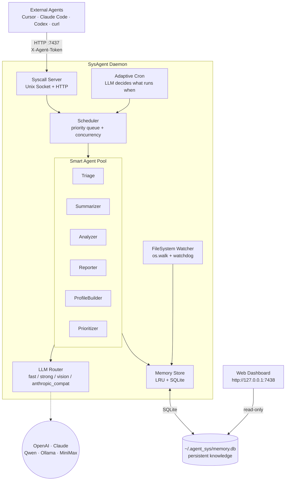

# agent-sys

**Languages / 语言:** English · [中文](README.zh-CN.md)

> **Status: under active development.** Try it out and please file feedback, bug reports, or ideas on [GitHub Issues](https://github.com/MarkfuGod/KernelAgent/issues). Public APIs, config, and CLI may keep changing until 1.0.

**A long-running local daemon that indexes your files and exposes an LLM-powered RPC surface.**

agent-sys runs in the background, continuously indexing directories you choose (defaults are `~/Documents` and `~/Desktop`; the first launch lets you confirm / edit), uses LLMs to tag, summarize, and extract knowledge from each file, and exposes a query API over Unix socket / HTTP.

When you're using an agent tool like Cursor or Claude Code, it can call agent-sys to get context about your local files and working habits — no need to re-scan from scratch every session.

> The modules below use OS-flavoured names (Kernel / Scheduler / Syscall / Cron / Memory) purely as a design narrative. Under the hood it's ordinary stuff — a task queue, an RPC server, a SQLite store, and an LLM router. Don't read the metaphor as a hard architectural constraint.

## Architecture at a glance



| Module | What it actually is | OS analogue |
|---|---|---|
| `SysAgentKernel` | Daemon entry point, manages subsystem lifecycle | Kernel / init |
| `AgentTask` | Smallest unit of work the scheduler consumes | Thread |
| `AgentScheduler` | Priority queue + semaphore + per-task timeout | Process scheduler |
| `FileSystemWatcher` | `os.walk` bulk scan + `watchdog` incremental | VFS |
| `MemoryStore` | LRU hot cache + SQLite cold store | RAM / disk |
| `SyscallServer` | Unix socket / HTTP RPC (19 endpoints; HTTP is easier for external agents) | Syscalls |
| `CronScheduler` | LLM-driven policy engine with rule-based fallback | Cron |

## Quick start

```bash
# Clone & install
git clone https://github.com/MarkfuGod/KernelAgent.git agent_sys
cd agent_sys
pip install -e ".[full]"

# Multimodal extras (PDF / Word parsing)
pip install PyMuPDF python-docx

# Start (first run prompts for LLM API keys; config is persisted)
agent-sys start

# Or detach as a background daemon
agent-sys start -d

# If a daemon is already running, `start` refuses (avoids cross-terminal kills)
agent-sys start          # → "already running (PID xxx), use 'agent-sys stop' first"
agent-sys start --force  # → explicit override, SIGTERM the old process first
```

## Plugging into AI agents — the `skills/` folder

The repo root has a `skills/` folder with three skills; each is a single `SKILL.md` with YAML frontmatter. This is Anthropic's [Agent Skills](https://www.anthropic.com/engineering/equipping-agents-for-the-real-world-with-agent-skills) format, **natively supported by Cursor and Claude Code**. Other tools (Codex, Windsurf, Cline, etc.) can read the same files as regular instruction markdown.

The three skills:

| Skill | When it triggers | Syscalls it uses |
|---|---|---|
| `agent-sys-user-context` | "based on what you know about me", "what have I been working on", "do you know me" | `report.brief` / `profile.get` / `analyze.behavior` |
| `agent-sys-file-search` | "find the notes I wrote about X", "look across my disk for Y" | `file.search` / `file.read` / `knowledge.query` |
| `agent-sys-admin` | "is the daemon up", "re-run triage manually", "switch models" | `agent-sys` CLI + `/status` |

### Cursor

Symlink the three skills into `~/.cursor/skills/`, then restart Cursor:

```bash
mkdir -p ~/.cursor/skills
for s in agent-sys-user-context agent-sys-file-search agent-sys-admin; do
  ln -sfn "$(pwd)/skills/$s" "$HOME/.cursor/skills/$s"
done
```

For a frozen snapshot (not tracking the repo) swap `ln -sfn` for `cp -r`.

### Claude Code

Claude Code's skill directory is `~/.claude/skills/`, same format:

```bash
mkdir -p ~/.claude/skills
for s in agent-sys-user-context agent-sys-file-search agent-sys-admin; do
  ln -sfn "$(pwd)/skills/$s" "$HOME/.claude/skills/$s"
done
```

If your Claude Code build doesn't recognize `~/.claude/skills/` yet, concatenate the `SKILL.md` contents into your project's `CLAUDE.md` (or `~/.claude/CLAUDE.md`) instead — the effect is identical.

### Codex CLI / anything using `AGENTS.md`

Codex, Aider and other tools read a single `AGENTS.md` instruction file. Concatenate the skills:

```bash
cat skills/agent-sys-*/SKILL.md > AGENTS.md
# Global: cat skills/agent-sys-*/SKILL.md > ~/.codex/AGENTS.md
```

YAML frontmatter is harmless inside markdown and can stay; if you want it cleaner, delete the `---` blocks at the top of each section manually.

### Generic fallback

If your agent doesn't support any of the above formats, just feed `skills/*/SKILL.md` in as a system prompt / context. The three files total under 300 lines and each is self-contained with trigger notes and curl examples.

### Try it

With the daemon running, say something like this to your agent:

> Based on what I've been doing this past week, help me plan priorities for this week.

The agent will auto-load `agent-sys-user-context`, run `curl -H "X-Agent-Token: $(cat ~/.agent_sys/auth_token)" http://127.0.0.1:7437/syscall ...` to fetch your brief, and answer from the real you instead of guessing.

## Web dashboard

```bash
agent-sys dashboard                 # serves http://127.0.0.1:7438
agent-sys dashboard --port 9000     # custom port
```

**Seven tabs:**

- **Overview** — total files, summarization progress, knowledge entries, daemon status, file-type pie chart, priority bars, recent modifications
- **Files & Directories** — file search + stacked bar chart of directory composition
- **LLM Config** — visually edit provider / model / API key (saves to `~/.agent_sys/llm_config.yaml`)
- **Triage** — triage distribution chart + pipeline flow + state descriptions
- **Knowledge Base** — browse reports, analyses, and scheduling decisions by category
- **Scheduling** — history of adaptive scheduling decisions
- **Summary Progress** — summarization progress by file type

The dashboard reads SQLite directly, so **it works even when the daemon is stopped**.

## Smart agent features

Once started, the daemon runs these agents in the background under adaptive LLM scheduling:

### Smart triage (v0.4+, mission-driven rework in v0.6)

```bash
agent-sys triage                    # run LLM triage
agent-sys triage --batch-size 1000  # bulk mode
```

Solves the core problem: out of 210k files, most third-party library sources don't justify spending LLM tokens on. v0.6 splits "filter" from "rank" — filtering uses rules, ranking uses **mission + user intent**.

- **Phase 1 — rule-based fast skip (zero LLM cost):** path substrings listed under `triage.skip_path_patterns` in `config/default.yaml` (e.g. `site-packages/`, `.cursor/extensions/`, `node_modules/`) are marked `skip` immediately.
- **Phase 2 — weighted ranking + LLM semantic triage:**
  - `triage.file_type_priority` determines "who gets analyzed first" (`.md=9 .docx=9 .py=7 .txt=3 .csv=2`) — when token budget is limited, higher-priority types are judged first.
  - `triage.hints` injects natural-language preferences into the LLM prompt (e.g. "my txt files are usually throwaway drafts").
  - The LLM batches by directory and picks one of four labels:
    - `high` — user-authored code, personal documents, study notes, personalized configs
    - `medium` — dependency configs, data files, project scaffolding
    - `low` — generic library code, standard templates
    - `skip` — third-party source, generated artifacts, raw datasets
- **Preferences ≠ hard rules:** `.txt` is low-priority by default, but a file named `journal.txt` can still be judged `high` by the LLM. Preferences only influence ordering and edge-case breaks; semantic judgment wins.
- The summarizer honors triage results: it processes `high` → `medium` first and skips `skip` / `low` entirely.

**Tuning preferences:** edit the `triage:` block in `config/default.yaml`:

```yaml
triage:
  file_type_priority:
    .md: 9       # I mostly write notes in markdown
    .py: 8       # Python projects come next
    .txt: 2      # txt is usually noise
  hints:
    - "PDFs in Downloads are usually study material worth summarizing"
    - "python files starting with test_ are tests and can be down-ranked"
```

### File summarization (Summarizer)

```bash
agent-sys summarize                 # manual run, prints each summary
agent-sys summarize --batch-size 50
```

- Handles **code** (content + LLM summary), **documents** (PDF / DOCX text extraction), **images** (vision model).
- Incremental: 30 files per batch, split across code / doc / image proportionally; it resumes automatically next run.
- Two modes: `deep` (reads file content — suited for nighttime) and `light` (metadata only — suited for daytime).
- **Respects triage:** only summarizes `high` / `medium` / untriaged files.

### Behavior analysis (Analyzer)

```bash
agent-sys analyze                   # full analysis (default: last 7 days)
agent-sys analyze --hours 24        # last 24h
```

Cross-cuts three dimensions: **work** (code projects, language preferences), **learning** (docs, tutorials), **personal life** (downloads, images).

### Reports (Reporter)

```bash
agent-sys report daily              # daily report across work / learning / life
agent-sys report brief              # context brief (drop into new agent sessions)
agent-sys report project            # per-project portrait
```

### Personal profile (Profile)

```bash
agent-sys profile                   # full LLM-built personal profile
```

### Priority classification (Prioritizer)

```bash
agent-sys classify                  # P0 hot / P1 warm / P2 cold, grouped by code / doc / image
```

### Browse past reports

```bash
agent-sys query --category daily_report        # daily reports
agent-sys query --category quick_report        # quick reports
agent-sys query --category context_brief       # context briefs
agent-sys query --category behavior_insight    # behavior analysis output
agent-sys query --category scheduling_decision # scheduling decisions
agent-sys query --category project_summary     # project-level summaries
```

## System status

```bash
agent-sys ping                      # is the daemon alive
agent-sys status                    # detailed status (scan progress, indexed files, etc.)
agent-sys stop                      # stop the daemon
```

## Calling agent-sys from external code

> The public import prefix is `agent_sys` (the source tree lives in `src/` and is re-exposed via a thin `agent_sys` shim package; `from agent_sys.syscall.client import ...` and `from src.syscall.client import ...` point at the same code).

### Python SDK (async)

```python
from agent_sys.syscall.client import SysAgentClient

async with SysAgentClient(caller="cursor") as client:
    results = await client.file_search("database migration")
    analysis = await client.analyze_behavior(hours=24)
    profile = await client.profile_get()
    brief = await client.report_brief()
    triage = await client.triage_files(batch_size=500)

    await client.context_save("session-abc", {"topic": "refactoring auth"})
    ctx = await client.context_load("session-abc")
```

### Python SDK (sync)

```python
from agent_sys.syscall.client import SyncSysAgentClient

with SyncSysAgentClient(caller="my_plugin") as client:
    results = client.file_search("config parser")
    profile = client.profile_get()
```

### HTTP API

`/health` and `/status` are open. Every call to `/syscall` requires
`X-Agent-Token: $(cat ~/.agent_sys/auth_token)`.

```bash
curl http://127.0.0.1:7437/health
curl http://127.0.0.1:7437/status

TOKEN=$(cat ~/.agent_sys/auth_token)
curl -X POST http://127.0.0.1:7437/syscall \
  -H "Content-Type: application/json" \
  -H "X-Agent-Token: $TOKEN" \
  -d '{"call_type": "triage.files", "params": {"batch_size": 500}, "caller": "curl"}'
```

## LLM configuration

Four provider types are supported:

| Provider | Purpose | Config |
|---|---|---|
| `openai` | OpenAI official API | `OPENAI_API_KEY` |
| `claude` | Anthropic Claude API | `ANTHROPIC_API_KEY` |
| `anthropic_compatible` | Anthropic-compatible API (e.g. MiniMax) | `ANTHROPIC_API_KEY` + `base_url` |
| `compatible` | OpenAI-compatible API (DeepSeek / Ollama / Qwen / etc.) | `COMPATIBLE_API_KEY` + `base_url` |

Pick any of:

1. **First launch** — `agent-sys start` walks you through an interactive setup.
2. **Web dashboard** — `agent-sys dashboard` → LLM Config tab.
3. **Manual edit** — `~/.agent_sys/llm_config.yaml`.

## Writing your own agent

```python
from agent_sys.agents.base import BaseAgent, AgentTask

class MyCustomAgent(BaseAgent):
    name = "my_custom_task"

    async def execute(self, task: AgentTask, context: dict) -> dict:
        memory = context["memory"]
        llm = context["llm"]
        # your logic here
        return {"result": "done"}

# Register with the scheduler
scheduler.register_agent(MyCustomAgent())
```

## Project layout

```
agent_sys/
├── config/
│   └── default.yaml              # master config (LLM + cron + adaptive + triage)
├── skills/                       # drop-in skills for Cursor / Claude Code / Codex
│   ├── agent-sys-user-context/
│   ├── agent-sys-file-search/
│   └── agent-sys-admin/
├── src/
│   ├── kernel/                   # kernel layer
│   │   ├── daemon.py             # daemon main loop
│   │   ├── config.py             # config loader (incl. AdaptiveConfig)
│   │   └── cron.py               # LLM-adaptive scheduler (incl. triage pipeline)
│   ├── llm/                      # unified LLM abstraction
│   │   ├── base.py               # LLMProvider interface (multimodal-aware)
│   │   ├── openai_adapter.py
│   │   ├── claude_adapter.py     # Claude + AnthropicCompatibleAdapter
│   │   ├── compatible_adapter.py # OpenAI-compatible APIs
│   │   └── router.py             # task → model routing
│   ├── filesystem/
│   │   └── watcher.py            # os.walk bulk scan + watchdog realtime
│   ├── memory/
│   │   └── store.py              # LRU + SQLite + multi-dimensional queries + triage ops
│   ├── scheduler/
│   │   └── pool.py               # priority queue + concurrency pool
│   ├── syscall/
│   │   ├── protocol.py           # 19 syscall types (RPC endpoints)
│   │   ├── server.py             # socket/HTTP server
│   │   └── client.py             # async + sync client SDKs
│   ├── agents/
│   │   ├── base.py               # AgentTask + BaseAgent
│   │   ├── builtin.py            # registers all 15 agents
│   │   ├── triage.py             # LLM-assisted file triage (rules + LLM)
│   │   ├── summarizer.py         # multimodal summaries (respects triage)
│   │   ├── analyzer.py           # holistic behavior analysis
│   │   ├── prioritizer.py        # file priority classification
│   │   ├── reporter.py           # multi-facet reports
│   │   └── profile_builder.py    # full personal profile
│   ├── web/                      # web dashboard
│   │   ├── dashboard.py          # aiohttp backend
│   │   └── dashboard.html        # dark-theme SPA (7 tabs)
│   ├── extractors.py             # PDF / DOCX / image content extraction
│   └── cli.py                    # CLI entry point (15 subcommands)
├── pyproject.toml
├── requirements.txt
└── README.md
```

## Design philosophy

In a conventional computer, the CPU uses a scheduler to dispatch threads to handle deterministic computation. In AgentOS, **the LLM uses a scheduler to dispatch agent threads to handle fuzzy, understanding-shaped tasks.**

Key differences:

- OS threads run deterministic compute → agent threads run tasks that need interpretation.
- OS file systems store bytes → AgentOS stores **understood** data.
- OS syscalls are synchronous function calls → AgentOS syscalls are async message passing.
- OS memory is byte-addressable → AgentOS memory is semantic-addressable (retrieval by meaning).
- OS cron runs a fixed schedule → AgentOS cron is **LLM-adaptive**.
- OS treats every file equally → AgentOS **triages** first and only deeply understands what's worth understanding.

Not a replacement for the operating system — an **agent-native runtime layer** sitting on top of one.

## Contributing

This project is under active development. Issues, bug reports, and pull requests are all welcome:

- Issues: <https://github.com/MarkfuGod/KernelAgent/issues>
- Repo: <https://github.com/MarkfuGod/KernelAgent>

中文版见 [README.zh-CN.md](README.zh-CN.md)。
